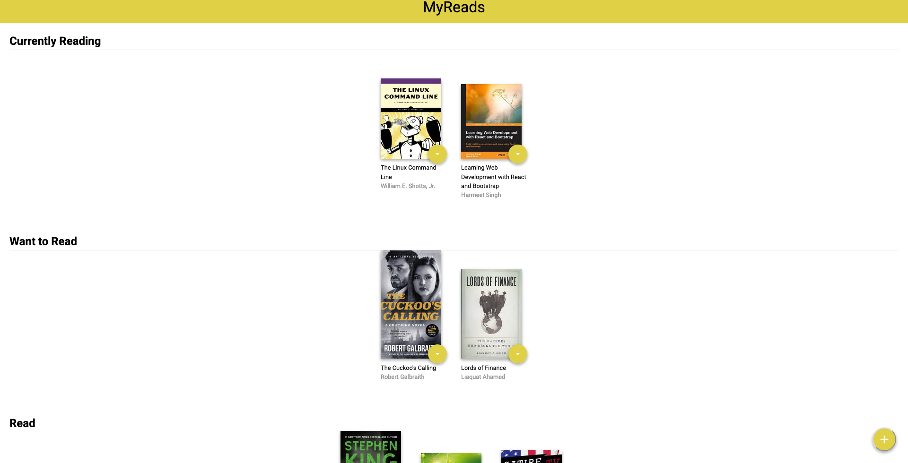
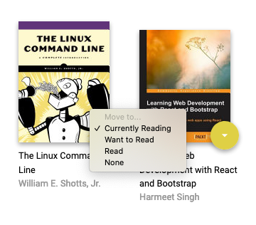
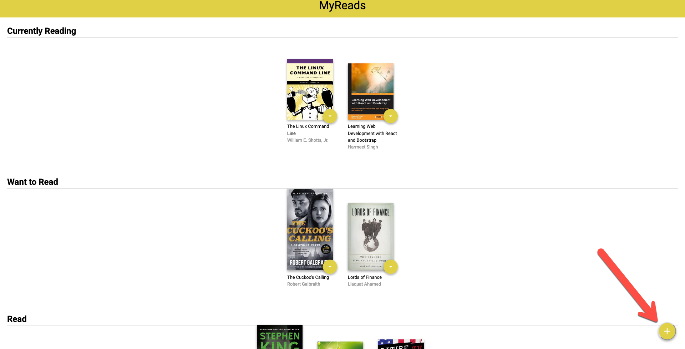
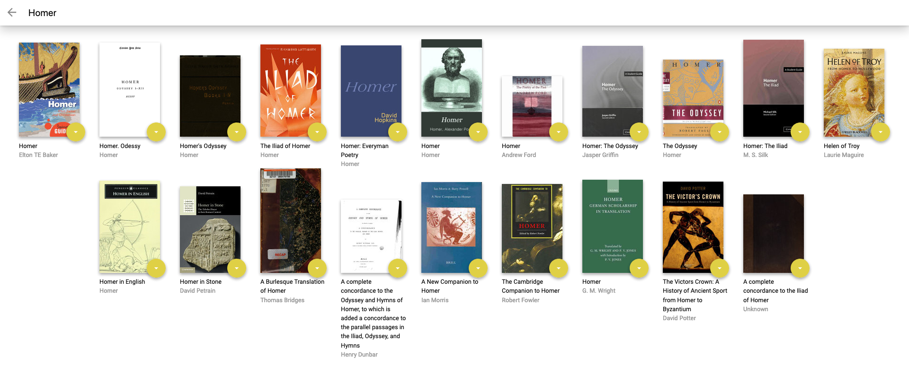
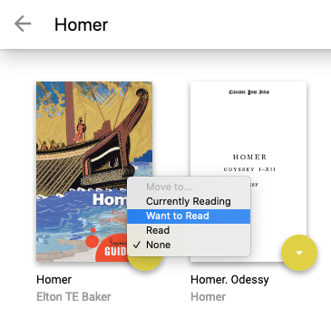
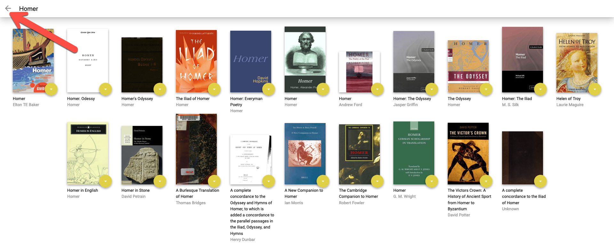
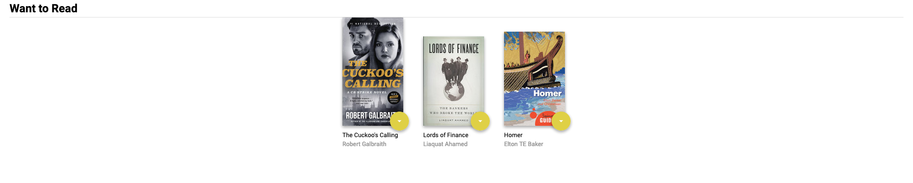

# MyReads

## Tools Used
React
JavaScript and ES6
npm
Github

## How To Setup
To get started:

* Install all project dependencies with `npm install`
* Start the development server with `npm start`

## App Tour
* Main page presents books in the users current shelves. There are three shelves categorized as "Reading", "Want To Read", and "Read". Books that pertain to those categories are displayed on the main page.  

* Books on the main page each have a drop down menu showing the current shelf and options to change to another shelf.

* Click on the add book button in the right bottom corner of the main page.

* In the search bar the user can input a variety of search keywords to search for a book. (Ex: Android, History, Thrun, iOS, etc.)

* Once the user finds a book, they can select from the drop down menu and choose a shelf to add the new book to.

* Once the user is done choosing a book, they can go back to the main page. 

* The user's new book is displayed on the chosen shelf. 

